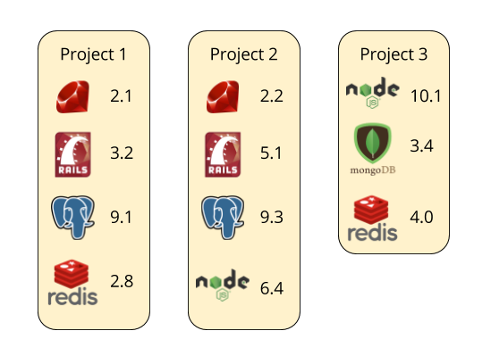
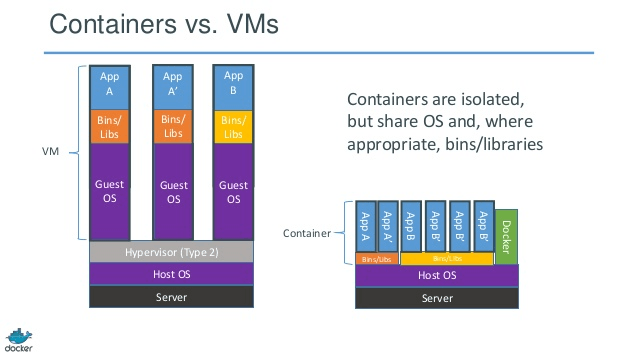

# Use Docker for your local environment

Workshop by [Augustin Riedinger](https://augustin-riedinger.fr)

 [@auGNUstin](https://twitter.com/Augnustin)

At [Capitole du Libre](https://2017.capitoledulibre.org) 19th November 2017

---

## Prerequisite

To attend this workshop, you need to have installed:

- [Docker](https://docs.docker.com/engine/installation/)
- [Docker-compose](https://github.com/docker/compose/releases)
- 3 Aliases

```
alias docker-enter="docker-compose run --rm --service-ports app /bin/bash"
alias docker-enter-again="docker-compose run --rm app /bin/bash"
alias docker-clean="docker ps -a | grep 'Exited\|Created' | cut -d ' ' -f 1 | xargs docker rm"
```

---

## Motivations

Are you working on a **single code base for your entire life**?

If so, you are **free to go**. :-)



But most of the time it's more like that, right?

---

## Alternatives

#### RVM, NVM, GVM tools?

- adds complexities
- doesn't exist for every technology (eg. Databases)
- local environment takes longer to setup
- messes your machine

#### Virtualbox/Vagrant?

- heavy in resources **AND** memory

> Now we have **DOCKER**

---

## What is Docker?



Over simplification:

+ reuses the host core functions (lib, clock, network etc.)
+ but isolates process from other applications

---

## Let's start an app

Let's make a simple Python [Flask](http://flask.pocoo.org) app.


Why Python? Simply because it is popular and easy to read.

**This tutorial remains valid with any unix-compliant technology**.

Q: How would you achieve this without docker?

---

### Two extra files

- `Dockerfile`

```
FROM ubuntu:latest
```

- `docker-compose.yml`

```yaml
app:
  build: .
  volumes:
    - .:/app
  ports:
    - "5000:5000"
```

Now type `docker-enter`...

---

### Inside the Matrix


What do you want to do?

- `whoami`
- `pwd`
- `ls`
- `ping gnu.io`
- etc.

---

### Back to App

From Flask's [getting started](http://flask.pocoo.org), first create `hello.py`:

```python
from flask import Flask
app = Flask(__name__)

@app.route("/")
def hello():
  return "Hello Capitole du Libre!"

app.run(host='0.0.0.0')
```

Then install in the terminal [`pip`](https://www.rosehosting.com/blog/how-to-install-pip-on-ubuntu-16-04/) and `Flask`:

```bash
apt-get update && apt-get install -y python-pip # no need sudo, we are root :)
pip install Flask
FLASK_APP=hello.py flask run
```

Go check [http://localhost:5000](http://localhost:5000) ;-)

---

### How it works?

Let's have a deeper look at `docker-compose.yml`:

```yaml
app:
  build: . # When doing `docker-compose build`, uses the `Dockerfile` in working directory
  volumes:
    - .:/app # Shares your machine working directory with docker's `/app`
  ports:
    - "5000:5000" # Shares your machine 5000 port with docker's 5000
```

And `Dockerfile`:

```
FROM ubuntu:latest
```

And `docker-enter` = `docker-compose run --rm --service-ports app /bin/bash`

---

### Saving changes

If I `exit` docker, and then `docker-enter` again to restart my server, I get:

```bash
root@d774482d9d98:/# FLASK_APP=hello.py flask run
bash: flask: command not found
```

That's because docker saves thing only during the `build` operation. All the rest is disposable.

---

### `Dockerfile`

To achieve this, you will have to store all the steps in your `Dockerfile`.

```
FROM ubuntu:latest
RUN apt-get update && apt-get install -y python-pip
RUN pip install Flask
```

And run `docker-compose build`. Now you can retry `docker-enter`.

---

### About `docker-compose`

`docker-compose` is a utility to store `docker` parameters in a separated file: `docker-compose.yml`.

Eg. The above command docker equivalent would be

`docker run -it -p 5000:5000 -v /home/augustin/Workspace/docker-local-tutorial/tutorial:/app ubuntu:latest bash`

And it could be worse!

---

### `docker-compose.yml` pimped

There are many possible entries in a `docker-compose.yml` file. Now let's pimp our file:

```yaml
app:
  build: .
  command: flask run # allow docker-compose up
  working_dir: /app
  volumes:
    - .:/app
  ports:
    - "5000:5000"
  environment: # Define as many environment variables as you want
    FLASK_APP: hello.py
```

And now type `docker-compose up`. :-)

---

## Persistent database

Now you'll want to have a database system connected, right?

Q: What do you suggest?

Install Redis in your app container?

---

### The Docker way

Rules of thumbs:

1. **One container per task** never more
2. Use [DockerHub](https://hub.docker.com/), the Github of Docker Images
3. Connect the containers thanks to `docker-compose`

---

### Linked containers

```yaml
app:
  build: .
  command: flask run
  volumes:
    - .:/app
  working_dir: /app
  ports:
    - "5000:5000"
  environment:
    FLASK_APP: hello.py
  links:
    - db
db:
  image: redis
```

And `docker-enter`...

---

### Where is my DB??

Your container is linked to the redis one. How do you know? **Environment variables!**

```bash
root@6bceb2f600f6:/app# printenv
HOSTNAME=6bceb2f600f6
PATH=/usr/local/sbin:/usr/local/bin:/usr/sbin:/usr/bin:/sbin:/bin
PWD=/app
...
DB_1_PORT_6379_TCP=tcp://172.17.0.3:6379
DB_1_ENV_GOSU_VERSION=1.10
_=/usr/bin/printenv
```

---

### Use it!

Edit `hello.py`

```python
app.config.update(
  # DB_1_PORT_6379_TCP=tcp://172.17.0.3:6379
  REDIS_URL=os.environ['DB_1_PORT_6379_TCP'].replace('tcp://', 'redis://')
)
```

---

### Persist the data

Despite containers being disposable, you might want to persist your DB data. How to do that?

```bash
mkdir data # Or whatever location that makes sense to you
```

Add a volume to the `db` container in the `docker-compose.yml`:

```yaml
db:
  image: redis
  volumes:
    - ./data:/data/db
```

---

## Multiple instances

Try typing `docker-enter` in another terminal:

```bash
$ docker-enter
Starting step3_db_1 ... done
ERROR: Cannot start service app: driver failed programming external connectivity on endpoint step3_app_run_2 (f0de78fe8cc341374ba1759c7cdb9e4d09ca7274bd3a5f41f11481b063917de5): Bind for 0.0.0.0:5000 failed: port is already allocated
```

So you need `docker-enter-again`

---

## Clean after yourself

Sometimes you won't exit your containers correctly. To check that, type `docker ps -a`.

```bash
6a6773464f28        30c2f2ec5c2f        "/bin/sh -c 'cd /app'"   36 hours ago        Exited (2) 36 hours ago                             elegant_thompson
...
```

To remove those, type `docker-clean`.

---

## Issues

Nothing's perfect

- node_module issue
- change owner of generated files
- memory usage

---

## Conclusion & Perspectives

- Very good for isolation
- Think functional/disposable, do not save state, but sequence of steps
- Install a dev environment in a single command: `docker-compose build`
- Wide repository of pre-built images, some can be a pain to create (eg. selenium)
- Will help you in production :-)

